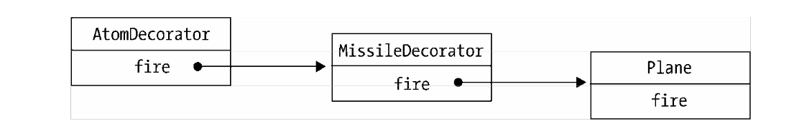

# 装饰着模式
### 定义
> 装饰着模式可以动态的给某个对象增加一些额外的职责,而不会影响从这个类派生出的其他对象.


### 应用


##### 模拟传统面向对象语言的装饰者模式

 假设我们在编写一个飞机大战的游戏，随着经验的增加，我们操作的飞机对象可以升级成更厉害的飞机，一开始这些飞机只能发射普通的子弹， 到第二级时可以发射导弹， 到第三级时可以发射原子弹。

```js
/**
 * 传统面向对象实现装饰着模式
 */
 var Plane = function(){
     console.log('普通飞机')
 }
 Plane.prototype.fire = function(){
     console.log('发射普通子弹')
 }
 //接下来增加两个装饰类，分别是导弹和原子弹
 var MissileDecoractor = function(plane){
    console.log('======升级导弹飞机=====')
     this.plane = plane;
 }
 MissileDecoractor.prototype.fire = function(){
     this.plane.fire();
     console.log('发射导弹');
 }

 var AtomDecorator = function(plane){
    console.log('======升级原子弹飞机=====')
     this.plane = plane;
 }
 AtomDecorator.prototype.fire = function(){
    this.plane.fire();
    console.log('发射原子弹');
 }

 let test = ()=>{
     let plane = new Plane();
     plane.fire();
     plane = new MissileDecoractor(plane);
     plane.fire();
     plane = new AtomDecorator(plane);
     plane.fire();
 }

 test();
```
导弹和原子弹对象的构造函数都接受`plane`参数,在它们的`fire`方法中,除了执行自身的操作外,还会调用`plane`对象的`fire`方法.

这种给对象动态增加职责,并没有真正的改动`plane`对象本身,而是将对象放入另外一个对象当中.
这些对象以一条链的方式进行引用,当请求到达链中的某个对象时,这个对象会先执行自身的操作,然后将请求转发给下一个对象.
在这里,被装饰对象`plane`不需要了解它被谁装饰过,这种特性使得我们可以递归的嵌套任意多个装饰对象.




##### 装饰函数中的`this`劫持

```html
<html>
    <button id="button"></button>
    <script>
        var _getElementById = document.getElementById;
        document.getElementById = function(id){ 
            console.log('=====装饰函数=====')
            return _getElementById( id); 
        }
        var button = document.getElementById( 'button' );
    </script>
 </html>
```


此时_getElementById 是一个全局函数， 当调用一个全局函数时，this是指向window 的，而 document.getElementById 方法的内部实现需要使用 this引用，this在这个方法内是指向document，而不是 window, 这是错误发生的原因，所以像这种直接调用原函数的方式并不保险 。

改进方式也很简单,在新的`getElementById`函数内部,显示指定原函数`_getElementById`的`this`指向.

```js
document.getElementById = function(){ 
    console.log('=====装饰函数=====')
    return _getElementById.apply(document,arguments); 
}
```
##### 用AOP装饰函数

```js
Function.prototype.before = function( beforefn ){
    var __self = this; //保存原函数的引用
    /*
        此函数的工作是把请求分别转发给新添加的函数和原函数,并且保证他们的执行顺序
        这样就实现了动态装饰的效果
    */
    return function(){ //返回了包含了原函数和新函数的装饰函数
        beforefn.apply( this, arguments ); //执行新函数,且保证this不被劫持.新函数接受的参数也会原封不动的传递给原函数
        return __self.apply( this, arguments ); //执行原函数并返回原函数的执行结果,并且保证this不被劫持
    } 
}
Function.prototype.after = function( afterfn ){ 
    var __self = this;
    return function(){
        var ret = __self.apply( this, arguments );
        afterfn.apply( this, arguments );
        return ret;
    }
};
```

```html
<!DOCTYPE html>
<html lang="en">
<head>
    <meta charset="UTF-8">
    <meta name="viewport" content="width=device-width, initial-scale=1.0">
    <meta http-equiv="X-UA-Compatible" content="ie=edge">
    <title>Document</title>
</head>
<body>
    <button id="button"></button>
    <script>
        Function.prototype.before = function( beforefn ){
            var __self = this;
            return function(){ //返回了包含了原函数和新函数的装饰函数
                beforefn.apply( this, arguments ); //执行新函数,且保证this不被劫持.新函数接受的参数也会原封不动的传递给原函数
                return __self.apply( this, arguments ); //执行原函数并返回原函数的执行结果,并且保证this不被劫持
            } 
        };
        Function.prototype.after = function( afterfn ){ 
            var __self = this;
            return function(){
                var ret = __self.apply( this, arguments );
                afterfn.apply( this, arguments );
                return ret;
            }
        };
        document.getElementById = document.getElementById.before(function(){ console.log ('装饰函数');});
        var button = document.getElementById( 'button' );
        console.log(button);

        window.onload = function(){
            console.log('window onload');
        }

        window.onload = window.onload.after(function(){
            console.log('after onload 1')
        }).after(function(){
            console.log('after onload 2')
        })
    </script>
</body>
</html>
```
这种在`Function`的`prototype`上扩展新方法, 最大的缺点就是会污染所有函数对象的原型.折中起见,我们可以为特定的类扩展`before`和`after`方法,杜绝对其他函数的污染.

##### 高阶函数

熟悉[redux](https://redux.js.org/)的同学都应该了解,外部属性通过`redux`的[connect](https://redux.js.org/docs/basics/UsageWithReact.html)函数注入到相应的组件当中.这里的connect就是典型的装饰者模式

### 小结
回顾装饰者模式的定义: 动态的给某个对象增加一些额外的职责,而不会影响从这个类派生出的其他对象.
被装饰函数无需感知自己是否被装饰,符合封闭开放原则.