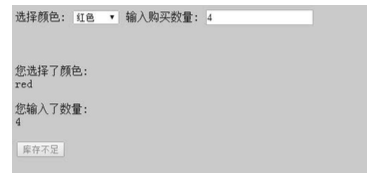

# 中介者模式
### 定义
> 中介者模式使各个对象之间得以解耦,以中介者和对象之间的的一对多的关系取代了对象之间的网状多对多的关系.各个对象只需关注自身功能的实现,对象之间的交互关系交给了中介者对象来实现和维护.

### 适用场景
一般来说,如果对象之间的复杂耦合确实导致调用和维护出现了困难,而且这些耦合度随着项目的变化呈指数增长曲线,那我们就可以考虑使用中介者模式来重构代码.

### 应用举例

##### 购买商品
假设我能正在编写一个手机购买的页面,在购买流程中,可以选择手机的颜色已经输入手机的数量,同时页面中有两个展示区域,分别向用户展示刚刚选择好的颜色和数量.还有一个按钮动态显示下一步的操作,我们需要查询改颜色手机对应的库存,如果库存受凉少于这次购买的数量,按钮将被禁止并且显示库存不足,反之按钮可以点击并且显示放入购物车.


那么页面可能显示如下几种场景.
1. 选择红色手机,购买4个,库存不足



2. 选择蓝色手机,购买5个,内存充足, 可以加入购物车.


3. 没有输入购买数量的时候,按钮将被禁用并显示相应的提示


根据需求先建立5个节点

1. 下拉选择框 colorSelect
2. 文本输入框 numberInput
3. 展示颜色信息 colorInfo
4. 展示购买数量信息 numberInfo    
5. 决定下一步操作的按钮  nextBtn

###### html模板

```html
<!DOCTYPE html>
<html lang="en">
<head>
    <meta charset="UTF-8">
    <meta name="viewport" content="width=device-width, initial-scale=1.0">
    <meta http-equiv="X-UA-Compatible" content="ie=edge">
    <title>Document</title>
</head>
<body>
    <h1>普通方式实现(未引入中介者)</h1>
    <div>
        <div>
            <span>选择颜色:</span>
            <select id="colorSelect">
                <option value="">请选择</option> 
                <option value="red">红色</option> 
                <option value="blue">蓝色</option>
            </select>
        </div>
        <div>
            <span>选择内存:</span>
            <select id="memorySelect">
                <option value="">请选择</option> 
                <option value="32G">32G</option> 
                <option value="16G">16G</option>
            </select>
        </div>
        <div>
            输入购买数量 : <input type="text" id="numberInput"/>
        </div>
    </div>
    <div>
        你选择了颜色 : <div id="colorInfo"></div><br/>       
        你选择了内存 : <div id="memoryInfo"></div><br/>       
        你输入了数量 : <div id="numberInfo"></div><br/>
        <button id="nextBtn" disabled="true">请选择手机颜色和购买数量</button>
    </div>
</body>
</html>
```

###### 不引入中介者实现

```js
var colorSelect = document.getElementById( 'colorSelect' ),
    numberInput = document.getElementById( 'numberInput' ), 
    memorySelect = document.getElementById( 'memorySelect' ), 
    colorInfo = document.getElementById( 'colorInfo' ), 
    numberInfo = document.getElementById( 'numberInfo' ),
    memoryInfo = document.getElementById( 'memoryInfo' ), 
    nextBtn = document.getElementById( 'nextBtn' );
    //检查输入的合法性
    function check(){
        var color = colorSelect.value,
        memory = memorySelect.value,
        stock = goods[ color + '|' + memory ];
        var number = numberInput.value;//数量
        
        if ( !color ){
            nextBtn.disabled = true; 
            nextBtn.innerHTML = '请选择手机颜色'; 
            return;
        }
        if ( !memory ){
            nextBtn.disabled = true; 
            nextBtn.innerHTML = '请选择手机内存'; 
            return;
        }
        if ( ( ( number - 0 ) | 0 ) !== number - 0 ){
            nextBtn.disabled = true;
            nextBtn.innerHTML = '请输入正确的购买数量'; 
            return;
        }
        if ( number > stock ){ // 当前选择的数量没有超过库存量        
            nextBtn.disabled = true; 
            nextBtn.innerHTML = '库存不足'; 
            return ;
        }
        return true;
    }

    var goods = { //手机内存  
        "red|32G": 3, // 红色32G数量为3
        "red|16G": 0,
        "blue|32G": 1,
        "blue|16G": 6
    };
    colorSelect.onchange = function(){
        colorInfo.innerHTML = this.value;
        if(check()){
        nextBtn.disabled = false; 
        nextBtn.innerHTML = '放入购物车';
        }
    }
    memorySelect.onchange = function(){
        memoryInfo.innerHTML = this.value;  
        if(check()){
        nextBtn.disabled = false; 
        nextBtn.innerHTML = '放入购物车';
        }
    }
    numberInput.oninput = function(){
        numberInfo.innerHTML = this.value;   
        if(check()){
        nextBtn.disabled = false; 
        nextBtn.innerHTML = '放入购物车';
        }
    }
```
这里每一个单位元素对自身的`change`事件进行控制,并独立改变`nextBtn`的状态和显示.虽然这里将公共验证部分`check`抽离了出来,但实际上`check`函数的职责并不单一,还承担了改变其他元素显示的逻辑.

###### 引入中介者

```js
    var goods = { //手机内存  
        "red|32G": 3, // 红色32G数量为3
        "red|16G": 0,
        "blue|32G": 1,
        "blue|16G": 6
    };
    var mediator = (function(){
        var colorSelect = document.getElementById( 'colorSelect' ),
        numberInput = document.getElementById( 'numberInput' ), 
        memorySelect = document.getElementById( 'memorySelect' ), 
        colorInfo = document.getElementById( 'colorInfo' ), 
        numberInfo = document.getElementById( 'numberInfo' ),
        memoryInfo = document.getElementById( 'memoryInfo' ), 
        nextBtn = document.getElementById( 'nextBtn' );
        return {
            changed: function(obj){
                var color = colorSelect.value,
                memory = memorySelect.value,
                stock = goods[ color + '|' + memory ],
                number = numberInput.value;
                if ( obj === colorSelect ){         
                    colorInfo.innerHTML = color;
                }else if ( obj === memorySelect ){ 
                    memoryInfo.innerHTML = memory;
                }else if ( obj === numberInput ){
                    numberInfo.innerHTML = number;
                }
                if ( !color ){
                    nextBtn.disabled = true; 
                    nextBtn.innerHTML = '请选择手机颜色'; 
                    return;
                }
                if ( !memory ){
                    nextBtn.disabled = true; 
                    nextBtn.innerHTML = '请选择手机内存'; 
                    return;
                }
                if ( ( ( number - 0 ) | 0 ) !== number - 0 ){
                    nextBtn.disabled = true;
                    nextBtn.innerHTML = '请输入正确的购买数量'; 
                    return;
                }
                if ( number > stock ){ // 当前选择的数量没有超过库存量        
                    nextBtn.disabled = true; 
                    nextBtn.innerHTML = '库存不足'; 
                    return ;
                }
                nextBtn.disabled = false; 
                nextBtn.innerHTML = '放入购物车';    
            }
        }
    })();
    colorSelect.onchange = function(){
        mediator.changed(this);
    }
    memorySelect.onchange = function(){
        mediator.changed(this);
    }
    numberInput.oninput = function(){
        mediator.changed(this);
    }
```
使用中介者模式重构过后,程序中增加了一个中介者对象`mediator`,单位元素自身改变之后直接通知中介者,在中介者中进行集中处理,虽然中介者承担了`check`的职责并改变其他单位元素的状态,具有一定的业务复杂性,但是单位元素之间实现了完全解耦.

### 优缺点
1. 中介者模式最大的优点是使各个对象之间得以解耦.
2. 最大的缺点是系统中会增加一个中介者对象,因为对象之间交互的复杂性转移成了中介者对象的复杂性,使得中介者对象经常是巨大的
3. 中介者对象自身往往是一个难以维护的对象.